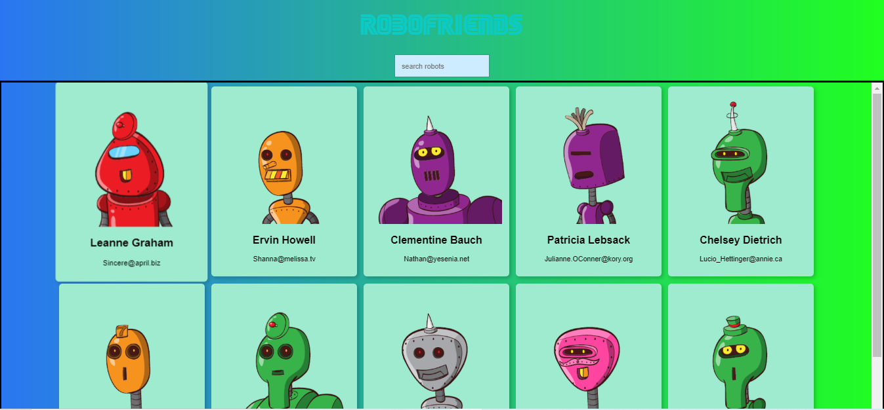

### Robots
This is a little app build base on React which consumes an API from https://jsonplaceholder.typicode.com/users

## Live link

* [☝ link](https://gruesome-tomb-62366.herokuapp.com/)

## Built With ✨

- JavaScript ECMA6
- Node.js
- React.js
- Redux
- Redux Thunk

To get a local copy up and running follow these simple example steps.

### Prerequisites
* Node.js installed
You will need Node.js up to v8

* System dependencies
Windows/ Mac

### Install
Clone project and run
`npm install`

## How to contribute and partipate
Fork this repo and submit a PR for review and potential merge to main branch

## Author

👨‍💻 **Christian Salazar**

- Github: [@grifo89](https://github.com/grifo89)
